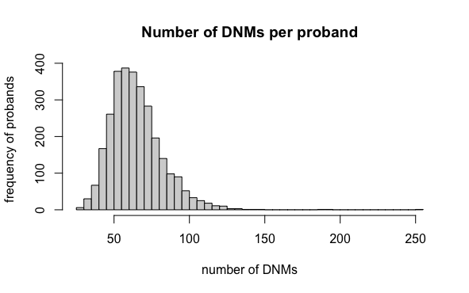
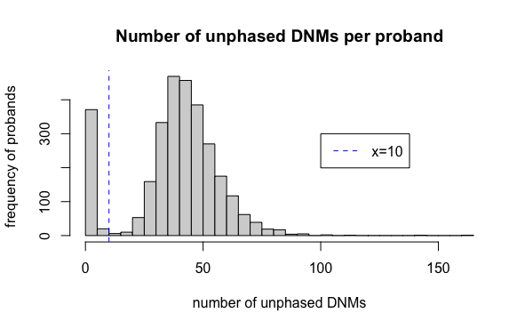
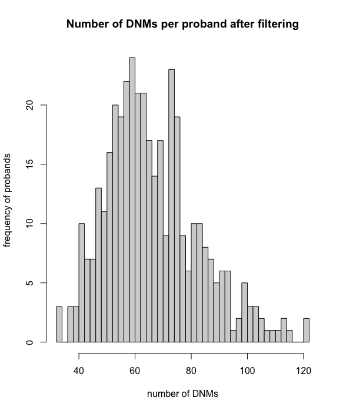

```{r, include = FALSE}
ottrpal::set_knitr_image_path()
```

# _De novo_ Mutations

In this module, we'll use DNA sequencing data from human families to explore the relationship between parental age and *de novo* mutations (DNMs) in their children.


## Learning objectives

After completing this chapter, you'll be able to:

1. Load and explore tabular data.
2. Create plots to visualize relationships between variables.
3. Compare the impact of maternal vs. paternal age on _de novo_ mutation counts.
3. Estimate how many mutations accumulate each year in maternal and paternal gametes.


## Background

**_De novo_ mutations** and recombination are two biolgical processes that generate genetic variation. When these phenomena occur during gametogenesis, the changes that they make to DNA are passed down to the next generation through germline cells (i.e., sperm and oocyte).

### _De novo) mutations

**_De novo_ mutations (DNMs)** arise from errors in DNA replication or repair. These mutations can be single-nucleotide polymorphisms (SNPs) or insertions and deletions of DNA. Every individual typically carries around 70 *de novo* SNPs that were not present in either of their parents.


### Recombination

**Crossovers**, or meiotic **recombination**, occur during prophase of meiosis I, when homologous chromosomes pair with each other. Double-strand breaks are deliberately generated in the DNA, and are then cut back and repaired based on the sequence of the homologous chromosome. These repairs can sometimes resolve in a crossover event, where sections of DNA are swapped between chromosomes.

Because the sequences of homologous chromosomes differ at sites where they carry different alleles, recombination generates genetic diversity by creating new haplotypes, or combinations of alleles.

Mutations are also more likely to occur at crossover sites as a result of the DNA damage. Additionally, double-strand breaks that do not resolve as crossovers have the potential to alter the DNA sequence through gene conversion, where the sequence of the damaged DNA is replaced by the sequence on the homologous chromosome.

Crossovers are required for meiosis because they ensure proper homologous chromosome pairing and segregation (although there are exceptions in some organisms, like male fruit flies). Humans experience 1-4 crossover events per chromosome, with longer chromosomes having more crossovers.


In this module, we'll be using sequencing data from families to look at the relationship between DNMs, crossovers, and parental age.

## Setup

### Using R Markdown files

In R Markdown files like these, you can run all the code contained in a "chunk" (like the one you see below) by pressing the green `>` button on the upper right-hand corner. You can also run individual lines of code by putting your cursor at the end of a line, or selecting multiple lines of code, and hitting `cmd + return` (Mac) or `ctrl + enter` (Windows).

```{r, results = FALSE, message = FALSE, warning = FALSE}
message("Welcome to the Human Genome Variation lab!")
```

### R packages

We'll be using R's `tidyverse` library to analyze our data. You can load this R package by running:

```{r, results = FALSE, message = FALSE, warning = FALSE}
library(tidyverse)
```

### Data

Our data comes from the paper [Characterizing mutagenic effects of recombination through a sequence-level genetic map](https://science.sciencemag.org/content/363/6425/eaau1043) by Halldorsson et al., which performed whole-genome sequencing on "trios" (two parents and one child) in Iceland.

The word "proband", derived from a Latin word meaning "to be proved/tested", refers to the offspring in the study (i.e. the test subjects).

We've downloaded the [data](https://science.sciencemag.org/content/363/6425/eaau1043/tab-figures-data) used in this study into this directory. For the primary analysis in this lab, there are two files of interest to us:

1. `aau1043_DataS5_revision1.tsv`: a modified [variant call format file](https://samtools.github.io/hts-specs/VCFv4.2.pdf), where each line in the file provides information about an observed *de novo* mutation (DNM)

{width=50%}

* The first column, `Chr`, lists the chromosome where the DNM is observed. 
* The second column, `Pos`, lists the genomic position on that chromosome where the DNM is observed. 
* The third column, `Ref`, lists the reference allele (A/C/G/T) when the DNM isn't present. 
* The fourth column, `Alt`, lists the DNM alternate allele (A/C/G/T or a combination of these bases as seen in row 14 above). 
* The fifth column, `Proband_id`, lists the proband ID or in which proband the DNM was present. 
* The sixth column, `Phase_combined`, provides from which parent the offspring inherited this DNM.
* The seventh column, `Crossover`, specifies whether the DNM is associated with a nearby crossover and from which parent the crossover originated (if able to be determined).
* The final column, `Sanger`, describes whether or not the DNM was confirmed through use of PCR & Sanger sequencing. For our purposes, we will largely be ignoring this information.

2. `aau1043_DataS7.tsv`: contains information about the paternal and maternal age for each proband at birth

{width=25%}

* The first column, `Proband_id`, matches the proband IDs from the first file and allows for connections between the two sets of data.
* The second column, `Father_age`, lists the paternal age for each proband at the time of birth.
* The third column, `Mother_age`, lists the maternal age for each proband at the time of birth.

<!-- ### Data pre-processing -->

<!-- The data from the Science paper has been aggregated and pre-processed for you. If you're interested in the details of how this was done, expand the section below. -->

<!-- *** -->
<!-- <details><summary> Pre-processing the data </summary> -->

<!-- We first read in the two tab-delimited data files from the website URLs, skipping header info. We specify that the files are tab-delimited with the `delim="\t"` arguments and skip the headers by using the `skip` argument). -->

<!-- ```{r, results = FALSE, message = FALSE, warning = FALSE} -->
<!-- library(tidyverse) -->

<!-- # science links are still broken!! -->
<!-- # dnm <- read_delim("https://www.science.org/doi/suppl/10.1126/science.aau1043/suppl_file/aau1043_datas5_revision1.tsv", delim = "\t", skip = 11) -->
<!-- # age <- read_delim("https://www.science.org/doi/suppl/10.1126/science.aau1043/suppl_file/aau1043_datas7.tsv", delim = "\t", skip = 4) -->

<!-- dnm <- read_delim("resources/data/dnm/aau1043_datas5_revision1.tsv", delim = "\t", skip = 11) -->
<!-- age <- read_delim("resources/data/dnm/aau1043_datas7.tsv", delim = "\t", skip = 4) -->
<!-- ``` -->

<!-- We then connect the information in the two files so that we keep all the information together for each proband. We use the `left_join()` function for this, specifically telling it to match the info given the `Proband_id` columns. We then take into account that one proband may have more than one DNM. For this lab, we don't care about a lot of the info for the DNMs (like the genomic location or the mutated sequences). We mostly care that for each proband we know how many DNMs were observed, and specifically, which parent the DNM originated from. We use the `summarize` function to find the number of DNMs that originated from the father for each proband -- `n_paternal_dnm`; the number of DNMs that originated from the mother for each proband -- `n_maternal_dnm`; and the number of DNMs for which it is unknown from which parent it originated -- `n_na_dnm`. Because some probands had more than DNM, when we used `left_join` to connect the two sets of data earlier, it meant that the parental ages for a given proband were repeated each time that proband was listed. So we also use the unique function so that the stored parental ages are just single values rather than a really long list repeating the same value for a given proband. Finally, we've included a column that lists the total number of DNMs each proband has. This column, `total_dnm` won't be in the pre-processed data you'll be reading in later. It's just for visualization purposes.    -->

<!-- ```{r, results = FALSE, message = FALSE, warning = FALSE} -->
<!-- dnm_by_age <- left_join(dnm, age, by="Proband_id") %>%  -->
<!--   group_by(Proband_id) %>%  -->
<!--   summarize(n_paternal_dnm = sum(Phase_combined == "father", na.rm = TRUE), -->
<!--             n_maternal_dnm = sum(Phase_combined == "mother", na.rm = TRUE), -->
<!--             n_na_dnm = sum(is.na(Phase_combined)), -->
<!--             Father_age = unique(Father_age), -->
<!--             Mother_age = unique(Mother_age)) %>%  -->
<!--   mutate(total_dnm = rowSums(.[, c("n_paternal_dnm", "n_maternal_dnm", "n_na_dnm")])) -->
<!-- ``` -->

<!-- Now you may be wondering, how many DNMs does each proband have? We'll use a histogram to visualize this.  -->

<!-- ```{r, results = FALSE, message = FALSE, warning = FALSE} -->
<!-- hist(dnm_by_age$total_dnm, breaks=50, main="Number of DNMs per proband", xlab="number of DNMs", ylab="frequency of probands") -->
<!-- ``` -->

<!-- <!--  --> -->

<!-- We see that there are about 65 DNMs per proband on average. The distribution also appears to be normally distributed, but it is right-skewed and has a long tail. -->

<!-- We're also interested in how many of these DNMs are unphased. By unphased, we mean that the authors couldn't determine from which parent the DNM originated. In other words, we're interested in the `n_na_dnm` column. When we plot a histogram of this data, we see a bi-modal distribution, where, again, the right section looks like a right-skewed normal distribution. -->

<!-- ```{r, results = FALSE, message = FALSE, warning = FALSE} -->
<!-- hist(dnm_by_age$n_na_dnm, breaks=50, main="Number of unphased DNMs per proband", xlab = "number of unphased DNMs", ylab="frequency of probands") -->
<!-- abline(v = 10, col="blue", lty=2 ) -->
<!-- legend(100, 300, col="blue", lty=2, legend = "x=10") -->
<!-- ``` -->

<!-- <!--  --> -->

<!-- On average, 39 of a proband's DNMs are unphased. This is nearly half of the total average. If we're more precise with this, and look at the number of unphased DNMs divided the number of total DNMs for each proband, we see that on average 60% are unphased.  -->

<!-- ```{r, results = FALSE, message = FALSE, warning = FALSE} -->
<!-- mean(dnm_by_age$n_na_dnm/dnm_by_age$total_dnm) -->
<!-- ``` -->

<!-- Since we're interested in the relationship of parental age with the number of DNMs originating from that parent, we want to work with data that is mostly phased, so we decide to filter our data to concentrate on the first section of the plot above. Specifically we keep those probands who have less than 10 unphased DNMs. The below code accomplishes that filtering. -->

<!-- ```{r, results = FALSE, message = FALSE, warning = FALSE} -->
<!-- dnm_by_age <- dnm_by_age %>%  -->
<!--   filter(n_na_dnm < 10) -->
<!-- ``` -->

<!-- Now we see that on average around 3% of DNMs are unphased for each proband, and this is much more manageable for the questions we want to explore. -->

<!-- ```{r, results = FALSE, message = FALSE, warning = FALSE} -->
<!-- mean(dnm_by_age$n_na_dnm/dnm_by_age$total_dnm) -->
<!-- ``` -->

<!-- If we rerun our plot from above for the total number of DNMs per proband, now that we've filtered, we observe that the mean number of total DNMs is 67, relatively unchanged compared to the full dataset. Further, the distribution appears less skewed.  -->

<!-- ```{r, results = FALSE, message = FALSE, warning= FALSE} -->
<!-- hist(dnm_by_age$total_dnm, breaks=50, main="Number of DNMs per proband after filtering", xlab="number of DNMs", ylab="frequency of probands") -->
<!-- ``` -->

<!-- <!--  --> -->

<!-- Now that we have tidy and filtered data, we drop the `total_dnm` column since we won't need that anymore and we save the data to a `.csv` file (which is a comma delimited file). -->

<!-- ```{r, results = FALSE, message = FALSE, warning = FALSE} -->
<!-- dnm_by_age <- subset(dnm_by_age, select=-c(total_dnm)) -->

<!-- write_csv(dnm_by_age, "dnm_by_age_tidy_Halldorsson.csv") -->
<!-- ``` -->

<!-- </details> -->
<!-- *** -->

We've pre-processed the data to make it easier to use, and you can load the pre-processed file using the code chunk below. (See the `Using R Markdown files` section above if you're not sure how to run the code chunk.)

```{r, results = FALSE, message = FALSE, warnings = FALSE}
dnm_by_age <- read.table("https://www.dropbox.com/s/e6p6nalccjj6j9y/dnm_by_age_tidy_Halldorsson.tsv?dl=1", sep = "\t", header = TRUE)
dnm_by_age
```

## Visualizing the data

Using our tidied data, we can now ask questions about the *de novo* mutation rate in these Icelandic individuals.

***
<details> <summary> Click here for a quick intro to `ggplot2` if you haven't completed the data visualization primer </summary>

RStudio Cloud has a great [primer](https://rstudio.cloud/learn/primers/3) that introduces data visualization with `ggplot2`. You've probably already completed this for homework. If you haven't done the primer and are new to `ggplot2`, we'll walk through a quick example by visualizing the relationship between maternal age and paternal age in this dataset.

`ggplot2` builds graphs from three components: a dataset (specified by `data =`), a coordinate system (specified by `aes =`), and a visual representation for the data points (specified with `geom_`).

Here we'll use data from the `age` table provided in the study. The table includes the father's age and mother's age for each child in the dataset, represented in the `Father_age` and `Mother_age` columns, respectively.

```{r}
# load the `age` data
age <- read.table("https://www.dropbox.com/s/dspyzp641w3anjd/aau1043_datas7.tsv?dl=1", sep = "\t", skip = 4, header = TRUE, encoding = "UCS-2LE")
age
```

We'll plot the data from this table, with maternal age on the x axis and paternal age on the y axis:

```{r}
# specify the data you want ggplot to use
ggplot(data = age,
       # specify where ggplot should be getting the x location for each data point
       aes(x = Father_age,
           # specify where ggplot should be getting the y location for each data point
           y = Mother_age)) +
  # specify that the data should be plotted as points
  geom_point()
```

</details>
***

We're interested in the relationship between age and the number of DNMs for males and females, and what that can tell us biologically.

**Coding practice:** How would you visualize this relationship for males using `ggplot2`?

***
<details> <summary> Solution </summary>

```{r}
dnm_by_age <- read.table("resources/data/dnm/dnm_by_age_tidy_Halldorsson.tsv.gz", sep = "\t", header = TRUE)

ggplot(data = dnm_by_age) +
  # specify that the data should be plotted as points
  geom_point(aes(x = Father_age, y = n_paternal_dnm))
```

```{r}
ggplot(data = dnm_by_age,
       # specify where ggplot should be getting the x location for each data point
       aes(x = Father_age,
           # specify where ggplot should be getting the y location for each data point
           y = n_paternal_dnm)) +
  # specify that the data should be plotted as points
  geom_point()
```

</details>
***

**Question:** Based on your plot, would you say that there's an association between paternal age and number of DNMs?

***
<details> <summary> Solution </summary>

It looks like there's a pretty strong association between paternal age and number of DNMs, where older males have more DNMs. This might be a bit hard to see because a lot of the points are getting plotted over each other - you can try `geom_bin2d` or changing the alpha (i.e., transparency) value (`geom_point(alpha = 0.3)`) to visualize the density of points better.

</details>
***

**Coding practice:** Modify the example code we wrote above to visualize the relationship between age and number of DNMs for *females*. Using the gray boxes as a guide of where code needs to be added, fill in the folllowing code block and run it when you're ready.

*Pattern code*

| `ggplot(data = ` <span style="background: dimgray; color: dimgray"> __ </span> `,`
|         `aes(x = ` <span style="background: dimgray; color: dimgray"> __ </span> `, y = ` <span style="background: dimgray; color: dimgray"> __ </span> `)) +`
|     `geom_point()`

<br /><br /><br />
*Code block*

```{r, eval = FALSE}
ggplot(data = ,
       aes(x = ,  y = )) +
  geom_point()
```

**Question:** Does there seem to be an association between maternal age and number of DNMs?

***
<details> <summary> Solution </summary>

```{r}
ggplot(data = dnm_by_age,
       aes(x = Mother_age,  y = n_maternal_dnm)) +
  geom_point()
```

There's also a strong positive association between maternal age and number of DNMs, although the slope (i.e., the increase in number of DNMs per year) is shallower.

</details>
***

## Linear models

Our null hypothesis is that there is no relationship between the parental (paternal or maternal) age and the number of DNMs originating from that parent.

We can formally consider the association between parental age the number of DNMs originating from that parent by fitting a linear line to the data and evaluating the slope. Further, we can ask if the slope is significantly different than 0. If it is, we reject the null hypothesis. 

In R, we will fit a linear model using the `lm` function. Run the following code block, and it will open a manual describing the function.

```{r, results = FALSE, message = FALSE, warnings = FALSE}
?lm
```

We see that the function needs to know what formula or equation it's evaluating and needs to know where the data is stored. Specifically for the formula, we use `response variable ~ predictor variable(s)`. Because we're passing the function the data frame, in the formula, we only have to use column names. 

**Question:** What is our predictor variable in this question? Is it the parental age or the number of DNMs originating from the parent?

***
<details><summary> Answer </summary>
It is the number of DNMs originating from the parent.
</details>
***

Given all of this information, we will use the following code to (1) fit the model & (2) print a summary of the model results (estimated slope, intercept, R-squared, etc.)

```{r, results = FALSE, message = FALSE, warnings = FALSE}
fit_pat <- lm(data = dnm_by_age, formula = n_paternal_dnm ~ Father_age)
summary(fit_pat)
```

**Question:** What is the slope for the relationship between the paternal age and the number of paternal associated DNMs? 

***
<details><summary> Answer </summary>
1.35
</details>
***

**Question:** Is the relationship significant (i.e. is the slope significantly different from 0)?

***
<details><summary> Answer </summary>
Yes, it is significant
</details>
***

**Question:** For every additional year in the father's age, how many additional DNMs do we expect to originate from the father?

***
<details><summary> Answer </summary>
1.35
</details>
***

**Coding practice:** Use the example code above (where we fit the paternal model) to now assess the relationship between maternal age and *de novo* mutations from the mother. Using the gray boxes from the *Pattern Code* as a guide of where code needs to be added, fill in the following *Code block* and run it when you are ready.

*Pattern code*

| `fit_mat <- lm(data = ` <span style="background: dimgray; color: dimgray"> __  </span> `,`
|                `formula = ` <span style="background: dimgray; color: dimgray"> __ </span> ` ~ ` <span style="background: dimgray; color: dimgray"> __ </span> `)`
| `summary(` <span style="background: dimgray;color: dimgray"> __ </span> `)`

<br /><br /><br />
*Code block*

``` {r, results = FALSE, message = FALSE, warnings = FALSE, eval=FALSE}
fit_mat <- lm(data = , 
              formula =   ~  )
summary()
```

Compare your code & results with the solution below


*** 
<details><summary> Solution </summary>

```{r, results = FALSE, message = FALSE, warnings = FALSE}
fit_mat <- lm(data = dnm_by_age, formula = n_maternal_dnm ~ Mother_age)
summary(fit_mat)
```

</details>
***

**Question:** What is the slope for the relationship between the maternal age and the number of maternal associated DNMs? 

***
<details><summary> Answer </summary>
0.38
</details>
***

**Question:** Is the relationship significant (i.e. is the slope significantly different from 0)?

***
<details><summary> Answer </summary>
Yes, it is significant
</details>
***

**Question:** For every additional year in the mother's age, how many additional DNMs do we expect to originate from the mother?

***
<details><summary> Answer </summary>
0.38
</details>
***

**Question:** How would you compare the paternal and maternal results?

***
<details><summary> Answer </summary>
Both show significant relationships with the number of inhertied DNMs, but the slope of the maternal association is shallower, suggesting that there are fewer additional DNMs for each additional year of the mother's age than there are for each additional year of the father's age.
</details>
***

## Confidence intervals

Let's formalize the comparison between the two associations by considering the confidence intervals. A confidence interval is a range of values in which, for some probability, the estimated interval will contain the true value of the unknown estimate (in our case the slope parameter). For a 95% confidence interval, the probability is 0.95. The interval itself has two boundaries, a lower boundary and an upper boundary. For a 95% confidence interval, these boundaries are labelled 2.5 % and 97.5%. Confidence intervals for two parameters may be non-overlapping or overlapping. If 95% confidence intervals for parameters from independent populations do not overlap, then this strongly supports that the parameters are significantly different from one another (for the 0.05 level of significance). The inverse statement, however, is not necessarily true. If 95% confidence intervals for parameters from independent populations do overlap, the parameters may still be significantly different; more analysis, like a hypothesis test, is needed to conclude one way or the other.

We can visually inspect whether the confidence intervals overlap using `ggplot`. But before that, we'll first see how to tangibly extract the slope values as well as the confidence intervals. We'll then construct a dataframe that has all 3 values (slope coefficient, the lower or 2.5 % confidence boundary, and the upper or 97.5 % confidence boundary) for both the paternal model and the maternal model. 

To extract a single slope coefficient from the linear model summarized results, we must first decide which coefficient we want. There is one for the intercept and one for the predictor variable. From the following code, we see both of these slope parameters.

```{r, results = FALSE, message = FALSE, warnings = FALSE}
fit_pat$coefficients
```

To extract just the `Father_age` slope, we add the name of the coefficient, as is done below. 

```{r, results = FALSE, message = FALSE, warnings = FALSE}
fit_pat$coefficients["Father_age"]
```

**Coding Practice:** Use the example above to extract just the `Mother_age` slope. Using the gray boxes from the *Pattern code* as a guide of where code needs to be added, fill in the following *Code block* and run it when you are ready.

*Pattern code*

<span style="background: dimgray; color: dimgray"> __ </span>`$coefficients[`<span style="background: dimgray; color: dimgray"> __ </span>`]` 

<br /><br /><br />
*Code block*

```{r, results = FALSE, message = FALSE, warnings = FALSE, eval = FALSE}
$coefficients[]
```

***
<details><summary> Answer </summary>
```{r, results = FALSE, message = FALSE, warnings = FALSE}
fit_mat$coefficients["Mother_age"]
```
</details>
***

The confindence intervals can be obtained with a function called `confint`. 

```{r, results = FALSE, message = FALSE, warnings = FALSE}
?confint
```

From the manual, we see that we will pass the function a fitted model, which parameter(s) we would like a confidence interval for from that model, as well as the `level` or the probability for which the confidence interval will contain the true value of the parameter. As an example below, we can extract the `Father_age` slope parameter's 95% confidence interval from the `fit_pat` fitted model.

```{r, results = FALSE, message = FALSE, warnings = FALSE}
confint(fit_pat, 'Father_age', level=0.95)
```

**Coding Practice:** Use the example above to obtain the 95% confidence interval associated with the `Mother_age` slope parameter from the maternal fitted model. Using the gray boxes from the *Pattern code* as a guide of where code needs to be added, fill in the following *Code block* and run it when you are ready.

*Pattern code*

`confint(`<span style="background: dimgray; color: dimgray"> __ </span> `,` <span style="background: dimgray; color: dimgray"> __ </span> `, level= ` <span style="background: dimgray; color: dimgray"> __ </span> `)`  

<br /><br /><br />
*Code block*

```{r, results = FALSE, message = FALSE, warnings = FALSE, eval = FALSE}
confint( , , level = )
```


***
<details><summary> Answer </summary>
```{r, results = FALSE, message = FALSE, warnings = FALSE}
confint(fit_mat, 'Mother_age', level=0.95)
```
</details>
***


We combine all of this data into a single dataframe using the code below. In this dataframe, the associations we were testing (`Father_age` and `Mother_age`) are separated into rows, and then the slope estimates as well as the confidence intervals are found in the columns.

```{r, results = FALSE, message = FALSE, warnings = FALSE}
pat_confint <- c(fit_pat$coefficients["Father_age"], confint(fit_pat, 'Father_age', level=0.95))
mat_confint <- c(fit_mat$coefficients["Mother_age"], confint(fit_mat, 'Mother_age', level=0.95))
confint_data <- as.data.frame(t(data.frame(Mother_age = mat_confint, Father_age = pat_confint)))
names(confint_data) <- c("Slopes", "Lower", "Upper")
confint_data
```

We can then plot these intervals next to each other either horizontally or vertically. Horizontally follows this pattern.
```
ggplot(dataframe_name) + 
  geom_point(aes(column_name_with_estimates, rownames(dataframe_name))) + 
  geom_errorbar(aes(xmin = column_name_with_lower_boundaries , xmax = column_name_with_upper_boundaries, y = rownames(dataframe_name), width = 0.1)) + 
  theme_minimal() + 
  ylab("Model") + 
  xlab("Coefficient")
```

Vertically follows this pattern. Notice that they differ in whether the estimates, range boundaries, labels, etc. are passed as `x` values or `y` values.
```
ggplot(dataframe_name) + 
  geom_point(aes(rownames(dataframe_name), column_name_with_estimates)) + 
  geom_errorbar(aes(ymin = column_name_with_lower_boundaries , ymax = column_name_with_upper_boundaries, x = rownames(dataframe_name), width = 0.1)) + 
  theme_minimal() + 
  ylab("Coefficient") + 
  xlab("Model")
```

**Coding Practice:** Use the above code outline to fill in the code block and plot the estimates and confidence intervals (replacing things like `dataframe_name`, `column_name_with_estimates`, etc.) and determine whether the intervals are overlapping or non-overlapping. Plotting vertically or horizontally is your choice.  

*Pattern code*

| `ggplot(` <span style="background: dimgray; color: dimgray"> __  </span> `) +`
|     `geom_point(aes(rownames(` <span style="background: dimgray; color: dimgray"> __  </span> `),` <span style="background: dimgray; color: dimgray"> __  </span> `)) +`
|     `geom_errorbar(aes(` <span style="background: dimgray; color: dimgray"> __  </span>`min=` <span style="background: dimgray; color: dimgray"> __  </span> `, ` <span style="background: dimgray; color: dimgray"> __  </span>`max =` <span style="background: dimgray; color: dimgray"> __  </span> `,` <span style="background: dimgray; color: dimgray"> __  </span> `=rownames(` <span style="background: dimgray; color: dimgray"> __  </span> `), width = 0.1)) +`
|     `theme_minimal() +`
|     <span style="background: dimgray; color: dimgray"> __  </span>`lab("Coefficient") + `
|     <span style="background: dimgray; color: dimgray"> __  </span>`lab("Model")`

<br /><br /><br />

*Code block*
```{r, results = FALSE, message = FALSE, warnings = FALSE, eval = FALSE}
ggplot() + 
  geom_point(aes(rownames(), )) + 
  geom_errorbar(aes( min= , max = , =rownames(), width = 0.1)) + 
  theme_minnimal() + 
   lab("Coefficient") + 
   lab("Model")
```


***
<details><summary> Vertical Answer </summary>
``` {r, results = FALSE, message = FALSE, warnings = FALSE}
ggplot(confint_data) + geom_point(aes(rownames(confint_data), Slopes)) + geom_errorbar(aes(ymin = Lower, ymax = Upper, x= rownames(confint_data), width = 0.1)) + theme_minimal() + ylab("Coefficient") + xlab("Model")
```

Note that the intervals are non-overlapping.
***

***
<details><summary> Horizontal Answer </summary>
``` {r, results = FALSE, message = FALSE, warnings = FALSE}
ggplot(confint_data) + geom_point(aes(Slopes, rownames(confint_data))) + geom_errorbar(aes(xmin = Lower, xmax = Upper, y = rownames(confint_data), width = 0.1)) + theme_minimal() + ylab("Model") + xlab("Coefficient")
```

Note that the intervals are non-overlapping.
***

## Conclusion

Thinking back to the learning objectives and the broad goal of this lesson, we loaded and explored pre-processed data using basic R and `ggplot` libraries. We further visualized the data and associations within the data, specifically using linear models to quantify the association between parental age and the number of DNMs an offspring has inherited. Further, we compared the paternal and maternal age associations to each other, and we found that the 95% confidence intervals are non-overlapping for the slopes. This strongly supports that the two associations are significantly different from one another. Let's ask a few questions about this finding.

1. What sorts of biological effects could a DNM have on the offspring?

2. There are statistically significant associations (a) between maternal age and the number of maternal DNMs inherited by the offspring, and (b) between paternal age and the number of paternal DNMs inherited by the offspring; Additionally, we can predict the number of DNMs an offspring will inherit given the parental age. However, do we know if there is a causative link in what we are observing or are these just correlations?

3. Assuming there is a statistical difference and a causative link, what biological reason(s) or mechanisms could account for paternal age leading to a greater number of additional DNMs for every year of paternal age (compared to the maternal)?

4. Do you have any hypotheses for genomic locations where DNMs may be enriched? Where & why?  

5. *Advanced:* Is it appropriate to use the comparison between confidence intervals as a means of assessing statistical significance? Specifically, we stated earlier, that to compare the confidence intervals, the parameters must originate from independent populations. Is this data independent? 

## Homework

#### Goals & Learning Objectives

The goal of this homework is to explore the distribution of crossovers in the genome.

**Learning Objectives**

* Required homework: Practice visualizing data with `ggplot2`
* Extra credit: Practice interpreting linear models

### Required

We will be using a data file from the Halldorsson et al. study with information about the crossovers that they observed in probands.

```{r, message=FALSE}
# crossovers <- read_delim("https://www.science.org/doi/suppl/10.1126/science.aau1043/suppl_file/aau1043_datas4.gz", delim = "\t", skip = 10)
# this file is on the McCoy lab onedrive because the science link is broken
crossovers <- read.table("https://www.dropbox.com/s/imk845vw1uvnixy/aau1043_datas4.gz?dl=1", sep = "\t", skip = 10, header = TRUE)
head(crossovers)
```

* `Chr`: Chromosome that the crossover occured on
* `lbnd`: Lower bound of crossover region
* `ubnd`: Upper bound of crossover region
* `pid`: Proband ID
* `ptype`: Parent that the crossover originated in (M: maternal, P: paternal)
* `medsnp`: Middle of crossover region
* `complex`: Indicator for whether this was a complex crossover (0: no, 1: yes)

**Assignment:** Plot the *distribution* of crossover locations for each chromosome. Add `facet_wrap(~ Chr, scales = "free")` to your ggplot object in order to separate the data by chromosome.

***
<details> <summary> Hint </summary>
What kind of graph should we use to show the *distribution* of data?
</details>
***

**Question:** Does this look like the distribution you would expect for crossovers? Where do you expect crossovers to occur more frequently?

***
<details> <summary> Solution </summary>

```{r}
ggplot(data = crossovers,
       aes(x = medsnp)) +
  geom_histogram() +
  facet_wrap(~ Chr, scales = "free")
```

It looks like a lot of crossovers are occuring near the ends of chromosomes. These regions are known to have elevated rates of recombination.
  
</details>
***

### Extra credit: More linear models

Use this code to generate a new dataframe, `crossovers_sum`, which sums the number of crossovers per child and adds information about the parents' ages:

```{r}
crossovers_sum <- crossovers %>%
  group_by(pid) %>%
  summarize(num_crossovers = n()) %>%
  merge(., age, by.x = "pid", by.y = "Proband_id")
```

**Assignment:** Fit two linear models to ask if there is an association between a child's number of crossovers and maternal age or paternal age. If there is an association, how is the number of crossovers predicted to change with every year of maternal/paternal age?

***
<details> <summary> Solution </summary>

```{r}
# fit the model with maternal age
fit_mat <- lm(data = crossovers_sum,
              formula = num_crossovers ~ Mother_age)
summary(fit_mat)

# get the coefficient for `Mother_age`, which tells us the effect size
fit_mat$coefficients["Mother_age"]
```

There is a significant association between maternal age and the child's number of crossovers. For every year of maternal age, we expect 0.05 fewer crossovers in the child.

```{r}
# fit the model with paternal age
fit_pat <- lm(data = crossovers_sum,
              formula = num_crossovers ~ Father_age)
summary(fit_pat)

# get the coefficient for `Father_age`, which tells us the effect size
fit_pat$coefficients["Father_age"]
```

There is also a significant association between paternal age and the child's number of crossovers. For every year of paternal age, we expect 0.11 fewer crossovers in the child.

</details>
***