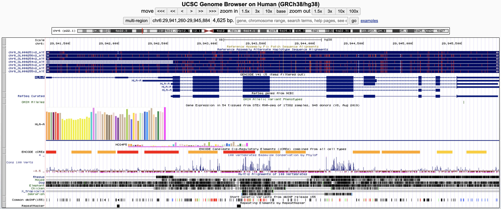
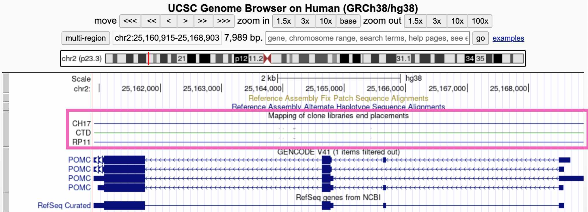

```{r, include = FALSE}
ottrpal::set_knitr_image_path()
```

# Genome Browsers

In this module, we'll learn how to use the **UC Santa Cruz (UCSC) Genome Browser** and the **Integrative Genomics Viewer (IGV)**, two extremely popular tools for visualizing genomic data.
<br></br>

<center>



</center>

## Learning objectives

After completing this chapter, you'll be able to:

1. Explain why a reference genome is an important resource for genomics research.
2. Load and navigate sequencing data in IGV.
3. Interpret IGV's visualizations of sequencing reads.


## DNA sequencing data

These days, the vast majority of genomic data is generated through **high-throughput Illumina short-read sequencing**. The broad steps of this sequencing process are:

* Extract DNA
* Fragment DNA
* Prepare for sequencer (add adapters, etc.)
* Amplify DNA
* Sequencing (add fluorescently labeled nucleotides that are read by a digital camera)

<br></br>

<center>

).** Schematic of Illumina short-read sequencing.](resources/images/igv/illumina.jpg){width=80%}

</center>

<br></br>

This sequencing approach is fast and cost efficient, but introduces two main limitations.

1. Because of the fragmentation step, the resulting sequencing reads are extremely short (~150 bp).
2. We don't know where in the genome the sequencing reads came from. (This is a limitation common to nearly every sequencing experiment.)

<br></br>

## Assembling a genome

When the human genome is 3 billion base pairs long, assembling short sequencing reads into a full genome is a major computational challenge.

***
<details> <summary> How is genome assembly performed? </summary>

We can combine sequencing reads that partially overlap with each other into longer sequences.


</details>
***

***
<details> <summary> Which regions of the genome are hardest to assemble? </summary>

Ideally, with enough sequencing data, we would be able to reconstruct an entire genome from overlapping reads. In practice, genome assembly is complicated by **repetitive DNA** -- sequences in different regions of the genome that are completely or nearly identical.

These repeats make it difficult (or impossible) to determine the order of the sequences around them, or how many copies of the repeat there are.


<br></br>
Resolving repetitive regions requires sequencing reads that are longer than the repeat itself, which allow us to determine the flanking sequences on the sides of the repeat.

Using such long-read sequencing technology (i.e., [PacBio](https://www.pacb.com/technology/hifi-sequencing/) and [Nanopore](https://nanoporetech.com/applications/dna-nanopore-sequencing) sequencing), the [Telomere-to-Telomere consortium](https://www.science.org/doi/10.1126/science.abj6987) was able to create a complete, ungapped assembly of the human genome in 2021.

</details>
***

## The human reference genome

Having to assemble an entire genome every time you sequence a new individual is a hassle (and often infeasible, if you don't have enough sequencing data). Instead, we typically align sequencing reads to a **reference genome** -- a high-quality genome assembly for that species, which we use to guide our analysis.

The human reference genome was initially assembled in 2000 by the [Human Genome Project](https://www.genome.gov/human-genome-project), and has undergone decades of refinement since. The current version of this reference, which we'll be using, is **hg38**.

***
<details> <summary> Whose DNA was sequenced for the human reference genome? </summary>

DNA from multiple individuals was sequenced to construct the reference genome. Its sequence is a mosaic of these individuals' DNA.

You can classify the ancestry of different parts of hg38 by comparing its sequence to DNA from different populations. From this, we know that around 70% of hg38 comes from one individual, called RP11, who likely had African American ancestry.
<br></br>

<center>

{width=50%}

</center>

</details>
***


## UCSC genome browser

What does the human reference genome actually look like? We can view it in the **UC Santa Cruz (UCSC) genome browser**, an interactive website for viewing genomes -- both the human reference and reference genomes for several other species.

The browser also displays **genome annotations**, such as the locations of genes and clinically relevant genetic variants.

Go to the [UCSC genome browser](https://genome.ucsc.edu/cgi-bin/hgGateway?hgsid=1537534853_Fxba671lul6Qu1chkXaoY68Kr3lP).

### Homepage

There are a couple of key areas of this page:

* `Browse/Select Species` -- choose the species
* `Human Assembly` -- choose the version of the human reference genome
* `Position/Search Term` -- type in a specific position (ex: `chr2:25160915`), region (ex: `chr1:100000-200000`), or gene name (ex: `HLA-A`)
<br></br>


<br></br>
In `Position/Search Term`, type in a gene you're interested in and hit enter.

***
<details> <summary> Why are there different versions of the reference genome? </summary>

You may have noticed that the name of the reference genome we're using is **`GRCh38`** or **`hg38`**, which stands for Genome Reference Consortium Human Build 38 -- version 38 of the reference genome.

Over time, the Genome Reference Consortium makes improvements to the reference genome by closing gaps, fixing problems, and resolving repetitive regions. hg38, the most recent version, was released in 2013.

</details>
***


## Viewing one region of the genome

Once you hit enter, you should end up on a page like this:
<br></br>


<br></br>
The default display includes these broad groups of annotations:

* **Navigation**: Buttons for zooming and moving around (you can also move by clicking the display, holding, and moving your mouse); current region; search bar
* **Position**: Current position on the chromosome; current base pair position
* **Genes**: Gene annotations; gene expression by tissue; gene regulatory elements (CREs)
* **Species comparison**: DNA sequence conservation across vertebrates; regions that align with the genomes of other vertebrates
* **Variation**: Genetic variants in the dbSNP database; repeat elements

***
<details> <summary> Inspecting a specific track </summary>

If you're interested in more information about a specific track -- for example, the _POMC_ gene annotation -- you can click on that element to go to a webpage with more details.


<br></br>
(Note that if you click on whitespace instead of an annotation element, it will change the track's display density instead.)


</details>
***


## Customizing browser displays

The tracks that are automatically displayed are just a small subset of what's available. You can select which tracks you want to see, and set their display density, by scrolling down on the page.

To add a new track to your browser view, click the drop-down menu below that track and select any of the options besides `hide`. Here we're viewing the "Clone Ends" track, which shows the different individuals that were sequenced to create this section of the reference genome.


<br></br>
Click the `refresh` button in the upper right to reload the genome view. You should see something like this, showing that this region of the reference genome was sequenced in three individuals (CH17, CTD, and RP11):




## IGV

While the UCSC genome browser lets you view the reference genome itself, we're often interested in looking at sequencing data -- sequencing reads that are aligned to the reference genome. For this we use the **Integrative Genomics Viewer (IGV)**.

Go to the [IGV web app](https://igv.org/app/).

### Homepage

The IGV homepage is fairly empty because we haven't loaded any sequencing reads to look at, and also because we're zoomed too far out to see anything.

* The `Genome` tab in the upper right lets you choose which reference genome to work in. The default is **hg38**
* A drop-down menu and search bar below the header allow you to pick a chromosome and genomic position


<!-- <br></br> -->
We haven't chosen a chromosome yet, so all of them are displayed below the drop-down menu. Click on one to go to a zoomed-in view of that particular chromosome.

## Genomic regions in IGV

Once you've clicked on a chromosome, zoom in until you can see colors on the top track. This track displays the DNA sequence, colored by nucleotide.

The track below the DNA sequence has gene annotations from RefSeq.
<br></br>


## Loading sequencing data

Click on the `Genome` drop-down menu and switch to the `Human (hg38 1kg/GATK)` reference genome. This version of the hg38 reference has sequencing data already loaded into the IGV web app.

Once you've switched references, click `Tracks` -> `1KG Low Coverage Alignments`. This gives you a list of sample to load sequencing data from. Click any sample and then `OK`.
<br></br>


## 1000 Genomes Project

***
<details> <summary> Where did this sequencing data come from? </summary>

In 2015, a study called the **[1000 Genomes Project](https://www.nature.com/articles/nature15393) (1KG or 1KGP)** sequenced 3,202 individuals from 26 globally diverse populations. Because this data is publicly available, it's become one of the most widely used datasets in human genetics.

Notably, 1KGP still excludes key regions of the world -- such as Oceania, the Middle East, native American populations in North America, and many populations within Africa.
<br></br>


</details>
***

Go to the [1000 Genomes Project website](https://www.internationalgenome.org/home) and click the `Data` tab. Then click the link to the `data portal`.
<br></br>


<br></br>
Choose any individual and copy their sample ID (ex: **HG00138**). We can use this sample ID to find this individual's raw sequencing data in the [Sequence Read Archive (SRA)](https://www.ncbi.nlm.nih.gov/sra).

## SRA

Search for the sample ID you chose in SRA. You should see something like this, where every item is a sequencing dataset generated for this sample.


### Previewing sequencing data in SRA

Choose any sequencing dataset, and then click on any item in the **`Run`** table at the bottom. 

This takes you to a page that displays a specific sequencing run (i.e., one use of the sequencing machine). Go to the **`Reads`** tab.


<br></br>
The right-hand panel shows one sequencing read from this run. Note that this read is around 100bp long -- the average length for short-read Illumina sequencing.

Every sequencing data file is just a text file with read IDs and each read's DNA/RNA sequence.


## Viewing sequencing reads

Now that we've seen what raw sequencing data looks like, let's look at it in IGV.

Return to your IGV tab, where you should have one sample's DNA sequencing data loaded. Make sure you're zoomed in enough for the data to display.


<br></br>
The top track is a histogram of sequencing coverage (i.e., how many reads there are at that position in the genome). The bottom track shows the reads themselves.

***
<details> <summary> How do we know where in the genome each read belongs? </summary>

Match the sequence of the read to the sequence of the reference genome (called **alignment**). With 100bp reads, the probability that a match occurs by chance is $\frac{1}{4^{100}}$, or $6.2 * 10^{-61}$.

</details>
***

***
<details> <summary> Extracting alignment information in IGV </summary>

If you click on a specific read, IGV will display additional information about it, including:

* The exact position it aligns to
* The mapping quality (a score indicating how uniquely it aligns to this position)
* If you're working with paired-end sequencing data, where its paired read is
<br></br>


</details>
***

## Interpreting IGV alignments

Sequencing reads in IGV are colored at bases where they differ from the reference genome. These differences can be caused by either real genetic variation or sequencing error. **How would you distinguish these two?**


<br></br>
The sequencing coverage track also colors the positions that it thinks are real variants.

In the screenshot above, which spans about 2kb, there are two SNPsin the coverage track. This pattern holds more broadly through the genome -- humans carry about **one SNP every 1,000 bases**.

***
<details> <summary> Is one SNP every 1,000bp a lot or a little? </summary>

Humans actually have much lower amounts of genetic variation than many species, [including many of the great apes](https://www.nature.com/articles/nature12228).

This is mostly the result of human evolutionary history. Because the effective size of human populations has historically been low, with only very recent expansion, the gene pool is still fairly homogenous, with many rare variants and few common ones.

</details>
***


## Conclusion

In this lab, we explored several of the most commonly used websites in genomics:

#### Genome browsers

* [**UCSC genome browser**](https://genome.ucsc.edu/): Used to explore features of the human genome
    * If you discover an interesting SNP in your research, you might look it up in the UCSC browser to see which genes it's in/near, if it overlaps with any repetitive elements, etc.
<br></br>
* [**IGV**](https://igv.org/app/): Used to visualize sequencing data
    * It's common practice to look at your sequencing reads in IGV to check alignment quality, verify that SNPs look like real variants and not errors, etc.

#### Data repositories

* [**1000 Genomes Project**](https://www.internationalgenome.org/home): One of the largest and most diverse datasets of human sequencing data
    * Data from 1000 Genomes is frequently used for human genetics research
<br></br>
* [**SRA**](https://www.ncbi.nlm.nih.gov/sra): A repository for publicly available sequencing data
    * Genetics studies deposit their data in SRA if it can be made publicly available (ex: if it has no identifiable information)


## Homework

#### Goals & Learning Objectives

The goal of this homework is to make an account in RStudio Cloud to use for the rest of the semester.

### Required homework

Follow the instructions [here](index.Rmd) to create an RStudio Cloud account and join the HGV workspace.

<!-- #### Goals & Learning Objectives -->

<!-- The goal of this homework is to familiarize yourself with the basics of R and RStudio Cloud. -->

<!-- **Learning Objectives** -->

<!-- * Become familiar with the RStudio Cloud workspace -->
<!-- * Learn basic R commands -->

<!-- ### RStudio tutorials -->

<!-- Follow the instructions [here](index.Rmd) to create an RStudio Cloud account and join the HGV workspace. -->

<!-- Then, complete the [Visualization and Programming Basics](https://posit.cloud/learn/primers/1) tutorials in RStudio Cloud. -->

<!-- There are several other R programming tutorials, which you're welcome to do if you want, but only these first two are required. -->