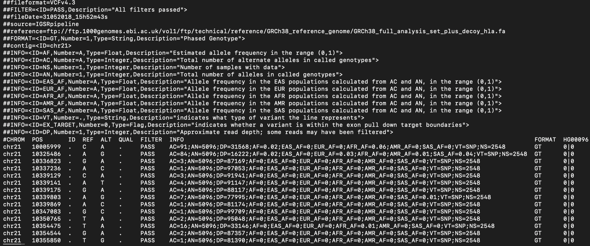

# Population structure

In this lab, we'll implement two common approaches for measuring and visualizing population structure: F~ST~ and principal component analysis (PCA).

## Learning objectives

After completing this chapter, you'll be able to:

1. Describe the data stored in a Variant Call Format (VCF) file.
2. Measure population differentiation from genotype data.
3. Perform and visualize the results of a principal component analysis.


***

## Geography of Genetic Variants

https://popgen.uchicago.edu/ggv/?data=%221000genomes


***


## Setup

### R packages

```{r}
library(tidyverse)
library(vcfR)
```

### Genotype data

```{r}
vcf <- read.vcfR(file = "random_snippet.vcf.gz")
```



### Metadata

```{r}
metadata <- read.table("integrated_call_samples.txt",
                       header = TRUE)
head(metadata)
```


***


## Tidying VCF data

`vcf` is an "Object of Class vcfR":

```{r}
vcf
```

Use the `vcfR2tidy` function to convert `vcf` into tidy dataframes:

```{r, message = FALSE}
# convert vcf into three tidy dataframes
tidied <- vcfR2tidy(vcf,
                    # tell vcfR to turn these INFO fields into integers
                    info_types = c(AF = "n", EAS_AF = "n",
                                   EUR_AF = "n", AFR_AF = "n",
                                   AMR_AF = "n", SAS_AF = "n"))
tidied
```

Store the variants information from `tidied` in a separate table:

```{r}
# make variants dataframe
variants <- tidied$fix
variants
```


***


## The allele frequency spectrum

Plot the _distribution_ of variant allele frequencies, using the `AF` column of `variants`.

```{r}

```


***


## Subset to common variants

We can look at which variants are "common" by adding vertical lines to the AFS plot.

```{r}
ggplot(data = variants,
       aes(x = AF)) + 
  geom_histogram(bins = 100) + 
  geom_vline(xintercept = 0.05, linetype = "dashed", color = "blue") +
  geom_vline(xintercept = 0.95, linetype = "dashed", color = "brown")
```

Run this code block to subset `vcf` and the `variants` dataframe to just common variation:

```{r}
# choose rows of `variants` that have AFs within range
common_rows <- (variants$AF > 0.05) & (variants$AF < 0.95)

# subset rows of the vcf object
vcf_common <- vcf[common_rows, ]
vcf_common

# subset the variants dataframe as well
variants_common <- variants[common_rows, ]
```

Re-plot the AFS to confirm that our subsetting worked.

```{r}

```


***


## The F~ST~ statistic

F~ST~ quantifies differentiation between populations, based on the frequencies of alleles at one variable site.

$$
\textrm{F}_{ST} = \frac{H_T - \textrm{mean}(H_S)}{H_T}
$$

We'll calculate F~ST~ with the `genetic_diff` function from `vcfR`.

```{r}
?genetic_diff
```

Use the `metadata` table to generate a vector of superpopulation labels for `genetic_diff`, converting to factors:

```{r}
pop_labels <- as.factor(metadata$superpop)
pop_labels
```

Run `genetic_diff` on the VCF of common variants:

```{r }
# calculate gst
gst_results <- genetic_diff(vcf_common, pop_labels) %>%
  # order dataframe by descending gst value
  arrange(-Gst)

head(gst_results)
```

Plot the distribution of G~ST~ across all variants.

```{r}

```

Convert to hg19 coordinates: https://genome.ucsc.edu/cgi-bin/hgLiftOver

Examine the top G~ST~ hit(s) in the GGV browser: https://popgen.uchicago.edu/ggv/?data=%221000genomes


***


## Principal component analysis

http://setosa.io/ev/principal-component-analysis/

### Reformatting data for PCA

We're using R's `prcomp` function to perform PCA on our genotype data. To reformat our data for `prcomp`, we need to:

1. Extract genotypes with vcfR's `extract.gt` function
2. Convert the genotypes into numeric values with tidyverse's `recode` function
    * **`0`** is homozygous reference (`0|0`)
    * **`1`** is heterozygous (`0|1`, `1|0`)
    * **`2`** is homozygous alternate (`1|1`)
3. **Transpose** (i.e., rotate) the matrix so the rows are samples and the columns are variants

```{r}
# extract genotypes from vcfR object
gt_matrix <- extract.gt(vcf_common) %>%
  # convert to dataframe so we can use tidyverse functions
  as.data.frame() %>%
  # apply `recode` function to all values in dataframe
  mutate_all(recode,
             "0|0" = 0, "1|0" = 1, "0|1" = 1, "1|1" = 2) %>%
  # convert back to matrix
  as.matrix()

head(gt_matrix)
```

Transpose the matrix with `prcomp`'s `t` function:

```{r, results = FALSE}
gt_matrix_T <- t(gt_matrix)
head(gt_matrix_T)
```

### Performing PCA

```{r}
pca <- prcomp(gt_matrix_T)
```

We can plot our PCA output using the information in `pca$x`.

```{r, results = FALSE}
x <- pca$x
head(x)
```

Create a dataframe of the first three PCs to plot:

```{r}
# create column of sample names
pca_results <- data.frame(sample = rownames(x),
                          PC1 = x[, 1], # PC1 values
                          PC2 = x[, 2], # PC2 values
                          PC3 = x[, 3]) # PC3 values
head(pca_results)
```

To annotate individuals on our plot, we'll **merge** `pca_results` with our `metadata` table.

```{r}
# merge pca_results and metadata
pca_results <- merge(pca_results, metadata,
                     # specify columns to merge on
                     by.x = "sample", by.y = "sample")
head(pca_results)
```

Create _scatterplots_ of PC1 vs. PC2 and PC2 vs. PC3, coloring by the `superpop` column:

```{r}
# PC1 vs. PC2

```

```{r}
# PC2 vs. PC3

```

### Proportion of variance explained

We can calculate proportion of variance explained from the `sdev` item in our `pca` object.

```{r}
sd <- pca$sdev
head(sd)
```

The proportion of variance explained by a PC is the variance, divided by the sum of the variances across all PCs. Run this code block to calculate it for all PCs:

```{r}
# divide variance of each PC by sum of all variances
var_explained <- sd^2 / sum(sd^2)

# proportion of variance explained for:
var_explained[1] # PC1
var_explained[2] # PC2
var_explained[3] # PC3
```

Add x and y axis labels to your PCA plots with the proportion of variance explained by each PC.

```{r}
# PC1 vs. PC2

```

```{r}
# PC2 vs. PC3

```


***


## Homework

We'll now perform PCA using _all_ SNPs in the initial VCF -- not just those that were common in 1000 Genomes individuals. In the optional homework, you'll also use your newly generated PCA plot to predict the ancestry of an unknown sample.

#### Goals & Learning Objectives

The goal of this homework is to perform and interpret the results of PCA.

**Learning Objectives**

* Required homework: Practice performing and interpreting PCA
* Optional homework: Practice performing PCA and reading code


## Required homework

**Assignment:** Re-run the steps we used to generate our PCA plot, this time using the original `vcf` data object. Do these plots look any different from our plots with just common variants?

```{r}

```


***


## Optional homework

We can think of our PCA as a _model_ of human individuals. If we have a mystery individual but we know their genotypes for the variants in our PCA, we can predict where they lie in PCA space and thus guess their ancestry.

We've prepared a VCF, `unknown.vcf.gz`, with genotypes for one mystery sample (`NA21121`). The VCF contains the **exact same variants** as our `random_snippet.vcf.gz` from this class.

Follow the instructions to read in the unknown VCF and predict NA21121's placement on your PCA plot. To avoid having to re-subset to common variants, we'll compare NA21121 to our PCA from the **required homework** (all variants in the VCF).

### Prepare unknown VCF for PCA

**Assignment:** Using our code from class, read in the unknown VCF file, extract the genotype matrix, recode the genotypes as numbers, and transpose.

```{r}
# read VCF
unknown <- _________

# extract and recode genotypes
unknown_matrix <- _________

# transpose matrix
unknown_matrix_T <- _________
```

### Predict PCA placement of unknown sample

**Assignment:** Run the code below to predict and plot NA21121 on top of your PCA plot from the required homework. If necessary, plot PC2 vs. PC3 as well. What superpopulation do you think NA21121 is from?

```{r}
# predict pca placement of unknown data
unknown_pca <- predict(_________, # your PCA object with all variants
                       unknown_matrix_T)

# create dataframe from predicted PCA
unknown_results <- data.frame("PC1" = unknown_pca[, "PC1"],
                              "PC2" = unknown_pca[, "PC2"],
                              "PC3" = unknown_pca[, "PC3"],
                              "sample" = "NA21121")

# plot PC1 vs. PC2 and then predicted sample
ggplot() +
  # PCA plot from required homework
  _________ +
  # plots the unknown sample's location on the PCs
  geom_label(data = unknown_results,
             aes(x = PC1, y = PC2, label = sample)) + 
  xlab("PC1 (9.15%)") +
  ylab("PC2 (3.82%)")
```